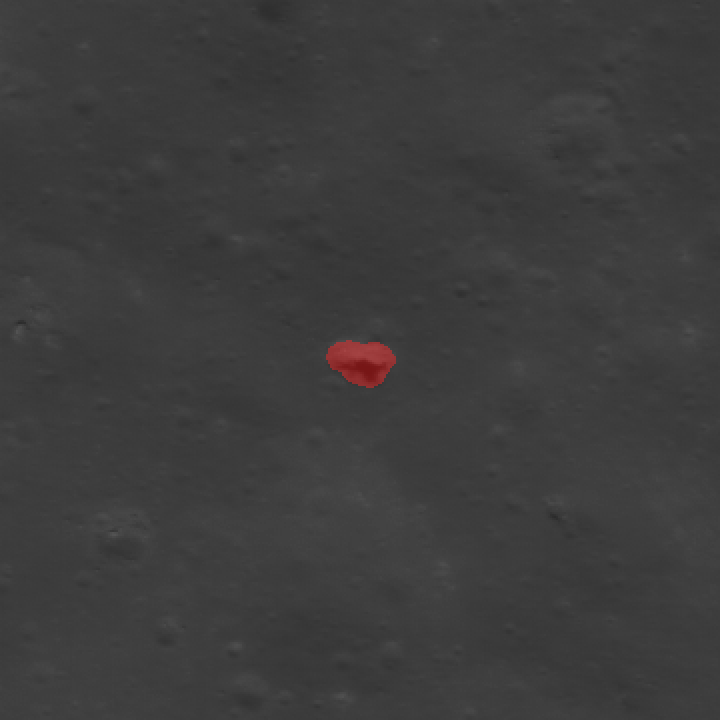
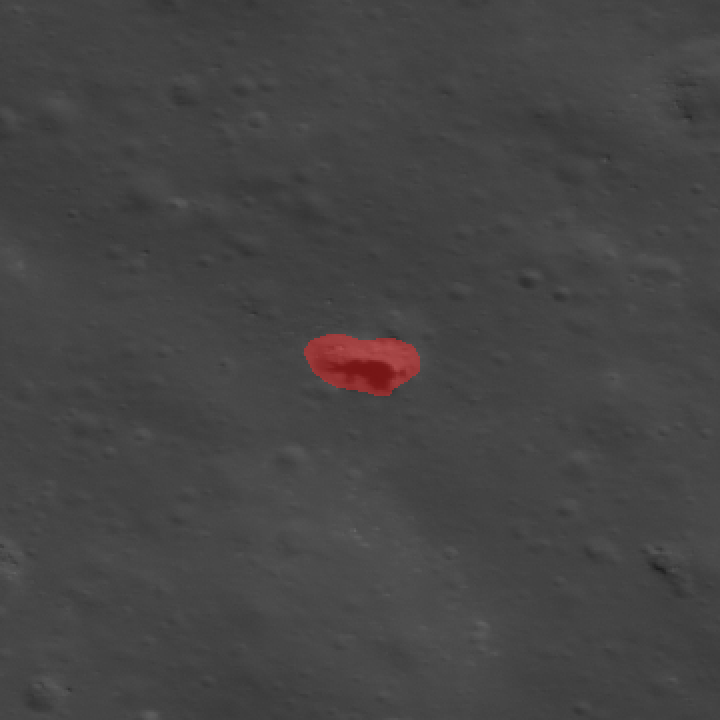
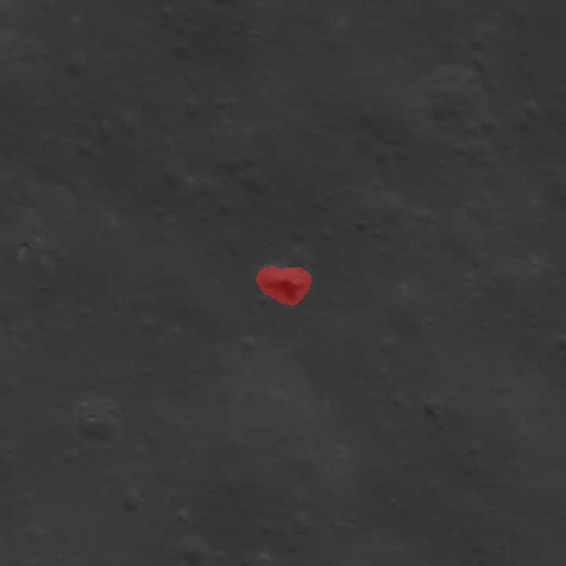
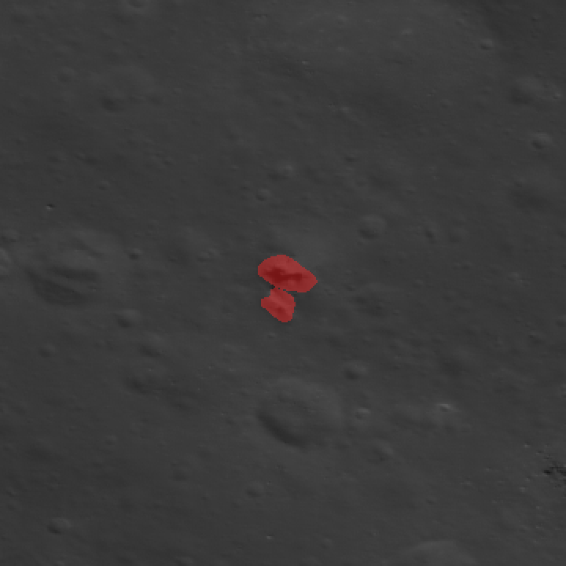

# luna

Lunar pit segmentation. A Mask R-CNN is trained on ellipse-approximated pit
masks derived from the ASU / Wagner Lunar Pit Atlas (`funnel_max_m`,
`funnel_min_m`, `azimuth_deg`), refined by hand, then run on fresh LROC NAC
frames to surface candidates that a human relabels and feeds back into the
next training round.

```
  LPA catalog + NAC --ellipse--> pseudo-masks --hand-label--> training set
                                                                    |
                                                                    v
                                                              Mask R-CNN train
                                                                    |
                        lon/lat candidates <---- inference on fresh NAC
                                 |
                                 v
                          human relabel -> next training round
```

## Main loop

1. **Build pseudo-label crops.** `scripts/build_ellipse_dataset.py` streams
   every (pit, NAC) pair in `catalogs/pit_nacs.json`, decodes the CDR, projects
   the LPA lon/lat to pixels (SPICE when kernels are available, bilinear-from-
   INDEX-corners fallback), rasterises an ellipse from the catalog dimensions,
   saves a 1024-px crop + COCO annotation, and deletes the `.IMG`. Output goes
   to `data/ellipse_ds/`.
2. **Hand-label.** `scripts/label_pits.py` opens each crop in a tkinter tool
   with the projected center marked as a subtle cross (it's a hint — see
   *Catalog accuracy* below). Draw a polygon, press Enter for next, `A` to
   add another pit on the same crop. Writes
   `data/ellipse_ds/pits_handlabeled.json` alongside the original ellipse file
   so nothing is overwritten.

   > **Labeling note — don't chase the shadow.** A pit typically contains a
   > deep, almost-black shadow that is visually dominant. The shadow is *not*
   > the pit boundary — it's just the sunless portion of the floor/wall. The
   > label should trace the full **rim opening** (the topographic edge where
   > the surface breaks into the pit), which extends well beyond the shadow
   > into the sunlit wall on the opposite side. If you only outline the
   > shadow, the model will learn "dark blob" and fire on every crater floor.
   >
   > **Use neighboring craters as a sun-direction cheat-sheet.** The shadows
   > cast by small craters around the pit all point the same way — that's the
   > illumination direction. For the pit itself, the shadow sits on the
   > anti-sun side of the opening, and the sunlit wall is on the sun side.
   > Read off the direction from any nearby crater, then mirror it across the
   > pit to find where the rim continues beyond the shadow.

   Examples from the current hand-labeled set (red = mask, zoomed ~250 px
   around the pit; NAC native resolution is 0.5–1 m/px):

   | Pit 22, NAC 1 | Pit 22, NAC 2 | Pit 22, NAC 3 |
   |---|---|---|
   |  |  |  |

   Same pit under three different illumination geometries — notice how the
   shadow-to-sunlit-wall ratio flips. The mask stays on the rim opening in
   all three. On the right, an example of a crop that contains two adjacent
   pits — both get annotated under the same image record:

   
3. **Train.** `scripts/train_maskrcnn.py` trains torchvision Mask R-CNN
   (2 classes: background + pit) on the hand-labeled COCO. *Not yet run
   end-to-end — the hand-labeled set is still being built. Expect rough edges;
   treat the first training run as shakedown.*
4. **Sweep fresh NACs.** `scripts/predict_nac.py` runs tile-sliding inference,
   dedupes by centroid, projects each detection back to lon/lat, and emits
   `candidates.csv` + crop/mask PNGs for review. *Also not yet battle-tested;
   depends on step 3 producing a checkpoint first.*
5. **Monthly refresh.** `scripts/monthly_pds_sweep.py` diffs the current LROC
   CDR archive against a stored snapshot; new volumes trigger step 4 on the
   added frames. Output candidates flow back into step 2.

## Install

```bash
python -m venv .venv
.venv/Scripts/activate        # Windows; .venv/bin/activate on Unix
pip install -e .
```

Python ≥ 3.10. Torch + CUDA are not pinned — install whatever wheel matches
your GPU before `pip install -e .`.

## Quickstart

```bash
# build a few pseudo-label crops
python scripts/build_ellipse_dataset.py --limit 5

# hand-label them
python scripts/label_pits.py

# see what's in the archive right now
python scripts/monthly_pds_sweep.py --dry-run
```

## Projection: SPICE vs. bilinear

LROC NAC is a pushbroom camera — the across-track coord of a ground point is a
function of spacecraft attitude at the time that pixel was exposed, not a
plane mapping. `luna/io/spice_project.py` implements the full SPICE inversion
(pure Python, `spiceypy`) and is the default.

Kernels are fetched on demand from the NAIF archive by
`luna.io.kernel_fetch.ensure_kernels_for_date`: each NAC's year metakernel is
parsed, filtered to entries whose time window contains the exposure, and the
missing files are pulled in parallel. **Cold fetch is ~1–2 GB per observation
year**, cached under `data/spice/lro/`. Subsequent NACs in the same window
are cache hits. If NAIF is down or the fetch errors, the builder silently
falls back to the INDEX.TAB 4-corner bilinear map and logs `projection =
"bilinear"` in the COCO record.

## Catalog accuracy caveat

The LPA lat/lon is accurate to ~50–100 m for minor pits — roughly 100 px at
full NAC resolution. SPICE is pixel-exact from the camera model, so the
projected pixel inherits the catalog's positional uncertainty. **The cross
that `label_pits.py` draws is a "start looking here" hint, not truth.**
Always trust the visible pit shadow over the marker.

## Layout

- `luna/io/` — PDS resolver (INDEX.TAB range reads), NAC CDR reader, SPICE
  projection, kernel fetcher, bilinear fallback
- `luna/labels/` — LPA CSV loader, ellipse mask rasteriser
- `luna/models/` — torchvision Mask R-CNN wiring + COCO dataset
- `catalogs/lpa.csv` — ASU Lunar Pit Atlas snapshot (278 pits)
- `catalogs/pit_nacs.json` — pit-id → list of referenced NAC products (811 pairs)
- `scripts/` — the 5-step main loop, one script per step

## Data sources

| Dataset | What it is | Access | License |
|---|---|---|---|
| **LROC NAC CDRs** | Radiometrically calibrated narrow-angle camera frames, 0.5–2 m/px, 52k × 5k px | [PDS LROC node](https://pds.lroc.im-ldi.com/data/) | Public domain (NASA) |
| **LRO SPICE** | Spacecraft ephemeris + attitude kernels | [NAIF archive](https://naif.jpl.nasa.gov/pub/naif/pds/data/lro-l-spice-6-v1.0/) | Public domain (NASA) |
| **Lunar Pit Atlas (LPA)** | 278 cataloged pits with lat/lon, funnel + inner diameters, azimuth, depth | [ASU atlas](https://lroc.im-ldi.com/atlases/pits/list) / Wagner & Robinson 2022 | Public domain |

## Contributing

The roadmap (steps 1–5 above) is the backlog. Pick one and run it end-to-end
before touching another — the real work is labeling pits and getting step 3
training, not scaffolding. Local state lives under `data/` — see `.gitignore`.
Don't commit checkpoints, NAC frames, or SPICE kernels; they're regenerable.
