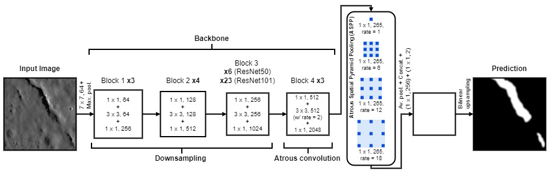

# IMFMapper - Automatically Mapping Impact Melt Fractures on the Moon with Deep Learning

## Introduction

After a meteorite hits a planetary body at hyper-velocity speeds, the surface material is melted into molten rock under the immense energies of an impact event. As the crater forms underneath, this pool of molten rock - often called an impact melt deposit - contracts as it cools over time. This contraction causes linear fractures to pop open on the surface of the impact melt deposit. 

Previously, these impact melt fractures (IMFs) have been manually mapped by researchers on the Moon and Mercury (Xiao et al. 2014), in order to investigate which cooling mechanisms may be most influential on airless bodies such as these. In this work, we use a Deep Learning model to automate this processes. Our model, called IMFMapper, has developed upon previous manual mapping (Thaker et al. 2020) of Crookes crater on the Moon and finds new impact melt deposits within its western and southern walls. We have also used IMFMapper to catalogue the IMFs found within the Moon's Schomberger A crater, which could potentially be trapping reserves of water ice within them due to being deprived of sunlight at such high latitudes (see https://doi.org/10.5281/zenodo.15101175).

## What is IMFMapper?

IMFMapper is a DeepLabV3 (Chen et al. 2016) semantic segmentation Deep Convolutional Neural Network (DCNN) with a ResNet50 trained to detect IMFs within Lunar Reconnaissance Orbiter Narrow Angle Camera (LROC NAC; Robinson et al. 2010) imagery (see **Figure 1**). Due to ranges of resolutions LROC NAC images can have (mostly between 0.5 to 1 m/px), IMFMapper was trained on tiled (512x512 pixels) and downscaled (to 1.5 m/px) data.

**Figure 1** - Algorithm diagram for IMFMapper - a DeepLabV3 Deep Convolutional Neural Network (DCNN) trained to perform semantic segmentation of LROC NAC imagery for impact melt fractures.

Due to the prevelance of these features and their thin widths, IMFs were manually labelled using 'weak' line labels in QGIS (https://qgis.org/) and then buffered to produce pixel-level annotations (see **Figure 2**)

**Figure 2** - Examples of impact melt fractures (IMFs) weak labelling. (a) Lunar impact crater 'Messier A' showing the LROC NAC image M126622485R and the location of the IMFs shown in (b to d). (c) Manually produced weak line labels and polygon annotations of the Lunar Pit Atlas (LPA; Wagner & Robinson 2021) features. (d) Pixel-level polygon labels created by buffering the lines in (c) and merging with the LPA polygons.

IMFMapper was trained on over 7,000 LROC NAC image tiles, around 2,600 of which contained no IMFs at all. Throughout the training process, these training tiles underwent data augmentation in the form of Contrast-Limited Adaptive Histogram Equalisation (CLAHE), addition of Gaussian noise, and perspective shift - each with a 50% probability of occuring for a single tile. **Figure 3** shows these processes being applied to an example training tile.

**Figure 3** - Examples of the data augmentation process applied during training upon the IMFs shown in **Figure 2**.

In order to select the best combination of model parameters and backone, IMFMapper was applied to two separate validation datasets: the first drawn from the same craters seen during training, and the second containing a selection of the IMFs found within Copernicus and Virtanen F. In independent testing against the IMFs within the southern half of Ohm crater's floor, IMFMapper achieved an average F1 score of 69.3% (corresponding to a precision and recall of 67.7 and 71.0%, respectively).

## How to use IMFMapper?

### Downloading the Model Checkpoint

The PyTorch model checkpoint file for IMFMapper (*IMFMapper_DeepLabV3_ResNet50.pt*) can be downloaded from Zenodo at https://doi.org/10.5281/zenodo.15101175. Instructions on how to load and re-train models using PyTorch model checkpoint files can be found at https://pytorch.org/tutorials/beginner/saving_loading_models.html. Otherwise, see the next section for inferring IMFMapper on your own LROC NAC 512x512 tiles.

### Inferring IMFMapper

Running the following Python script (with the correct requirements installed) will perform semantic segmentation upon the image tiles in *path/to/images/dir* and save the output to *path/to/output/dir*. The image tiles must be in GeoTiff format so that IMFMapper can output its detections as geo-referenced shapefiles at the correction location on the Lunar surface. It is also recommended that only 512x512 LROC NAC image tiles at 1.5 m/px resolution are fed to IMFMapper, since this is the form of data that it was trained upon.

`python IMFMapper.py -i path/to/images/dir/ -o path/to/output/dir/ -m path/to/IMFMapper_DeepLabV3_ResNet50.pt`

### Requirements

The following versions were used to create `IMFMapper.py`.

- python==3.11.0
- gdal==3.6.2
- pytorch==2.5.1
- pytorch-cuda=12.4
- torch==2.4.0
- torchvision==0.19.0

## References

Chen et al. (2016). DeepLab: Semantic Image Segmentation with Deep Convolutional Nets, Atrous Convolution, and Fully Connected CRFs. *arXiv e-prints*. doi: 10.48550/arXiv.1606.00915.

Robinson et al. (2010). Lunar Reconnaissance Orbiter Camera (LROC) Instrument Overview. *Space Science Reviews*, 150(1-4):81–124. doi: 10.1007/s11214-010-9634-2.

Thaker et al. (2020). Morphological analysis and mapping of complex craters of Copernican age: Crookes, Ohm and Stevinus. *Planetary and Space Science*, 184:104856. doi: 10.1016/j.pss.2020.104856.

Wagner & Robinson (2021). Occurrence and Origin of Lunar Pits: Observations from a New Catalog. In *52nd Lunar and Planetary Science Conference*, Lunar and Planetary Science Conference, page 2530.

Xiao et al. (2014). Cooling fractures in impact melt deposits on the Moon and Mercury: Implications for cooling solely by thermal radiation. *Journal of Geophysical Research (Planets)*, 119(7):1496–1515. doi: 10.1002/2013JE004560.